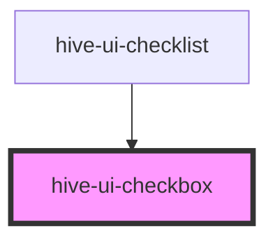

# hive-ui-checkbox

<!-- Auto Generated Below -->

## Properties

| Property   | Attribute  | Description                                                                                                                                                                                                                                           | Type      | Default        |
| ---------- | ---------- | ----------------------------------------------------------------------------------------------------------------------------------------------------------------------------------------------------------------------------------------------------- | --------- | -------------- |
| `checked`  | `checked`  | If `true`, the checkbox is selected.                                                                                                                                                                                                                  | `boolean` | `false`        |
| `disabled` | `disabled` | If `true`, the user cannot interact with the checkbox.                                                                                                                                                                                                | `boolean` | `false`        |
| `name`     | `name`     | The name of the control, which is submitted with the form data.                                                                                                                                                                                       | `string`  | `this.inputId` |
| `small`    | `small`    |                                                                                                                                                                                                                                                       | `boolean` | `undefined`    |
| `value`    | `value`    | The value of the toggle does not mean if it's checked or not, use the `checked` property for that.  The value of a toggle is analogous to the value of a `<input type="checkbox">`, it's only used when the toggle participates in a native `<form>`. | `string`  | `'on'`         |

## Events

| Event        | Description                                    | Type                |
| ------------ | ---------------------------------------------- | ------------------- |
| `hiveBlur`   | Emitted when the toggle loses focus.           | `CustomEvent<void>` |
| `hiveChange` | Emitted when the checked property has changed. | `CustomEvent<any>`  |
| `hiveFocus`  | Emitted when the toggle has focus.             | `CustomEvent<void>` |

## Dependencies

### Used by

 - [hive-ui-checklist](../checklist)

### Graph

----------------------------------------------

*Built with [StencilJS](https://stenciljs.com/)*
