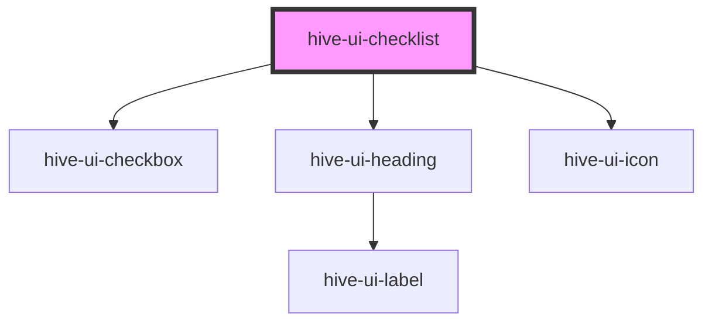

# hive-ui-checklist

<!-- Auto Generated Below -->

## Properties

| Property | Attribute | Description                                                          | Type               | Default     |
| -------- | --------- | -------------------------------------------------------------------- | ------------------ | ----------- |
| `item`   | --        | The  interface for each option to keep track of its value.           | `CheckListItems`   | `undefined` |
| `items`  | --        | The array that is used to display the options that can be checked.   | `CheckListItems[]` | `[]`        |
| `select` | --        | The array that is updated and emitted on each checklist item select. | `any[]`            | `[]`        |
| `value`  | `value`   | The value of the item connected to the checkbox.                     | `any`              | `undefined` |

## Events

| Event        | Description                                                   | Type               |
| ------------ | ------------------------------------------------------------- | ------------------ |
| `hiveChange` | Emitted when a checkbox is checked or clear function is used. | `CustomEvent<any>` |

## Methods

### `clear() => Promise<void>`

#### Returns

Type: `Promise<void>`

## Dependencies

### Depends on

- [hive-ui-checkbox](../checkbox)
- [hive-ui-heading](../../typography/heading)
- [hive-ui-icon](../../icon)

### Graph

----------------------------------------------

*Built with [StencilJS](https://stenciljs.com/)*
