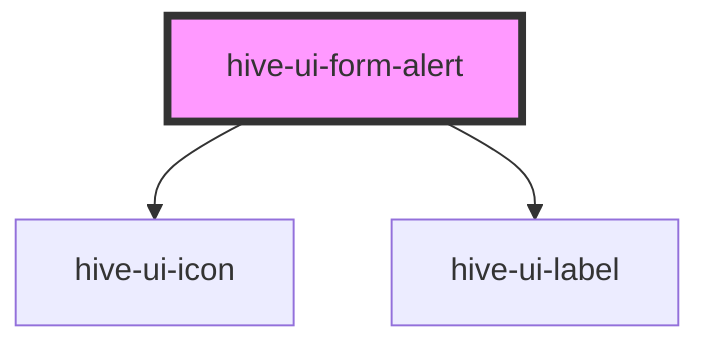

# hive-ui-form-alert

<!-- Auto Generated Below -->

## Properties

| Property | Attribute | Description | Type                                 | Default    |
| -------- | --------- | ----------- | ------------------------------------ | ---------- |
| `type`   | `type`    |             | `"danger" \| "success" \| "warning"` | `'danger'` |

## Dependencies

### Depends on

- [hive-ui-icon](../../icon)
- [hive-ui-label](../../typography/label)

### Graph

----------------------------------------------

*Built with [StencilJS](https://stenciljs.com/)*
