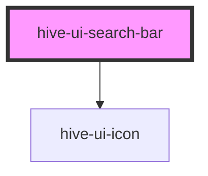

# hive-ui-search-bar

<!-- Auto Generated Below -->

## Properties

| Property      | Attribute     | Description                                                                                              | Type      | Default     |
| ------------- | ------------- | -------------------------------------------------------------------------------------------------------- | --------- | ----------- |
| `autofocus`   | `autofocus`   | Auto focuses the search bar.                                                                             | `boolean` | `true`      |
| `debounce`    | `debounce`    | Set the amount of time, in milliseconds, to wait to trigger the `hiveChange` event after each keystroke. | `number`  | `250`       |
| `disabled`    | `disabled`    | If `true`, the user cannot interact with the input.                                                      | `boolean` | `false`     |
| `placeholder` | `placeholder` | Sets the input's placeholder.                                                                            | `string`  | `undefined` |
| `value`       | `value`       | The value of the search bar.                                                                             | `string`  | `''`        |

## Events

| Event        | Description                              | Type                         |
| ------------ | ---------------------------------------- | ---------------------------- |
| `hiveBlur`   | Emitted when the input loses focus.      | `CustomEvent<void>`          |
| `hiveChange` | Emitted when the value has changed.      | `CustomEvent<any>`           |
| `hiveFocus`  | Emitted when the input has focus.        | `CustomEvent<void>`          |
| `hiveInput`  | Emitted when the keyboard input ocurred. | `CustomEvent<KeyboardEvent>` |

## Methods

### `setFocus() => Promise<void>`

Sets focus on the specified `hive-ui-search-bar`. Use this method instead of the global
`input.focus()`.

#### Returns

Type: `Promise<void>`

## Dependencies

### Depends on

- [hive-ui-icon](../../icon)

### Graph

----------------------------------------------

*Built with [StencilJS](https://stenciljs.com/)*
