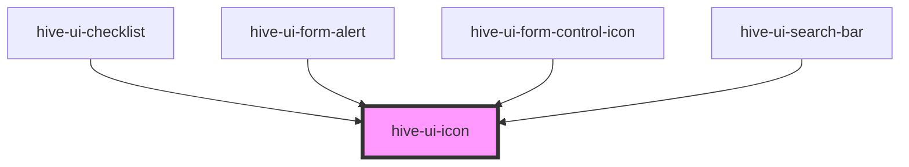

# ion-icon

<!-- Auto Generated Below -->

## Properties

| Property    | Attribute    | Description                                                                                     | Type                                                                                                                                                                                                                                                                                     | Default     |
| ----------- | ------------ | ----------------------------------------------------------------------------------------------- | ---------------------------------------------------------------------------------------------------------------------------------------------------------------------------------------------------------------------------------------------------------------------------------------- | ----------- |
| `ariaLabel` | `aria-label` | Specifies the label to use for accessibility. Defaults to the icon name.                        | `string`                                                                                                                                                                                                                                                                                 | `undefined` |
| `color`     | `color`      |                                                                                                 | `"app-light-gray" \| "black" \| "blue" \| "charcoal" \| "dark-blue" \| "dark-gray" \| "gold" \| "light-blue" \| "light-gray" \| "light-green" \| "magenta" \| "medium-blue" \| "medium-gray" \| "medium-green" \| "medium-yellow" \| "mint" \| "purple" \| "red" \| "white" \| "yellow"` | `undefined` |
| `lazy`      | `lazy`       | If enabled, ion-icon will be loaded lazily when it's visible in the viewport. Default, `false`. | `boolean`                                                                                                                                                                                                                                                                                | `false`     |
| `name`      | `name`       | Specifies which icon to use from the built-in set of icons.                                     | `string`                                                                                                                                                                                                                                                                                 | `undefined` |
| `size`      | `size`       | The size of the icon. Available options are: `"small"` and `"large"`.                           | `string`                                                                                                                                                                                                                                                                                 | `undefined` |

## Dependencies

### Used by

 - [hive-ui-checklist](../form/checklist)
 - [hive-ui-form-alert](../form/form-alert)
 - [hive-ui-form-control-icon](../form/form-control-icon)
 - [hive-ui-search-bar](../form/search-bar)

### Graph

----------------------------------------------

*Built with [StencilJS](https://stenciljs.com/)*
