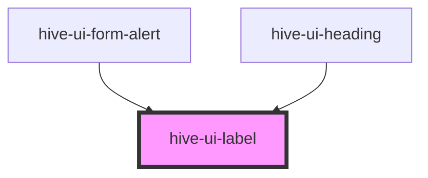

# hive-ui-label

<!-- Auto Generated Below -->

## Properties

| Property     | Attribute    | Description                                                                                                           | Type                                                                                                                                                                                                                                                                                     | Default     |
| ------------ | ------------ | --------------------------------------------------------------------------------------------------------------------- | ---------------------------------------------------------------------------------------------------------------------------------------------------------------------------------------------------------------------------------------------------------------------------------------- | ----------- |
| `base`       | `base`       |                                                                                                                       | `boolean`                                                                                                                                                                                                                                                                                | `undefined` |
| `bold`       | `bold`       |                                                                                                                       | `boolean`                                                                                                                                                                                                                                                                                | `undefined` |
| `book`       | `book`       |                                                                                                                       | `boolean`                                                                                                                                                                                                                                                                                | `undefined` |
| `capitalize` | `capitalize` |                                                                                                                       | `boolean`                                                                                                                                                                                                                                                                                | `undefined` |
| `color`      | `color`      | The primary color of the label. Uses the branded CSS variables that are globally available to the application.        | `"app-light-gray" \| "black" \| "blue" \| "charcoal" \| "dark-blue" \| "dark-gray" \| "gold" \| "light-blue" \| "light-gray" \| "light-green" \| "magenta" \| "medium-blue" \| "medium-gray" \| "medium-green" \| "medium-yellow" \| "mint" \| "purple" \| "red" \| "white" \| "yellow"` | `undefined` |
| `large`      | `large`      |                                                                                                                       | `boolean`                                                                                                                                                                                                                                                                                | `undefined` |
| `lowercase`  | `lowercase`  |                                                                                                                       | `boolean`                                                                                                                                                                                                                                                                                | `undefined` |
| `maxLines`   | `max-lines`  | The maximum lines to display before truncating the text. Default behavior shows all lines of text with no truncation. | `number`                                                                                                                                                                                                                                                                                 | `undefined` |
| `medium`     | `medium`     |                                                                                                                       | `boolean`                                                                                                                                                                                                                                                                                | `undefined` |
| `semibold`   | `semibold`   |                                                                                                                       | `boolean`                                                                                                                                                                                                                                                                                | `undefined` |
| `small`      | `small`      |                                                                                                                       | `boolean`                                                                                                                                                                                                                                                                                | `undefined` |
| `type`       | `type`       |                                                                                                                       | `"label" \| "text"`                                                                                                                                                                                                                                                                      | `'text'`    |
| `uppercase`  | `uppercase`  |                                                                                                                       | `boolean`                                                                                                                                                                                                                                                                                | `undefined` |
| `xbold`      | `xbold`      |                                                                                                                       | `boolean`                                                                                                                                                                                                                                                                                | `undefined` |
| `xlarge`     | `xlarge`     |                                                                                                                       | `boolean`                                                                                                                                                                                                                                                                                | `undefined` |
| `xsmall`     | `xsmall`     |                                                                                                                       | `boolean`                                                                                                                                                                                                                                                                                | `undefined` |
| `xxlarge`    | `xxlarge`    |                                                                                                                       | `boolean`                                                                                                                                                                                                                                                                                | `undefined` |

## Dependencies

### Used by

 - [hive-ui-form-alert](../../form/form-alert)
 - [hive-ui-heading](../heading)

### Graph

----------------------------------------------

*Built with [StencilJS](https://stenciljs.com/)*
